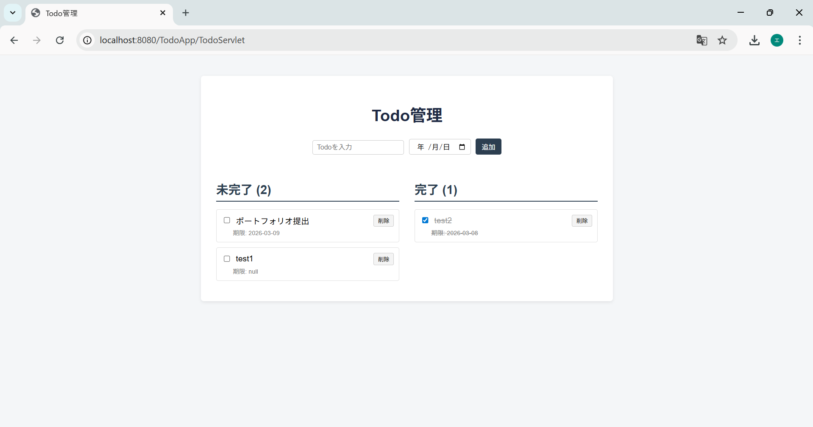

# TodoApp

Java（Servlet + JSP）で作成したシンプルなTodo管理アプリです。
学習のアウトプットとして作成しました。

---

## 概要

Todoの追加・削除・完了管理ができるWebアプリです。
MVC構造を意識して実装しています。

---

## スクリーンショット


---

## 主な機能

* Todo追加
* 期限日設定
* 完了チェック
* Todo削除
* 未完了 / 完了の分離表示

---

## 使用技術

* Java
* Servlet
* JSP
* HTML / CSS
* Apache Tomcat
* Eclipse

---

## アーキテクチャ

MVC構造で実装しています。

### Model

**Todo.java**
Todoデータ（タイトル、期限、完了状態）を管理

### Controller

**TodoServlet.java**
リクエスト処理とTodo操作

### View

**index.jsp**
Todo一覧表示と入力フォーム

---

## ディレクトリ構成

```
TodoApp
│
├ src
│ └ todo
│   ├ model
│   │   └ Todo.java
│   │
│   └ servlet
│       └ TodoServlet.java
│
├ WebContent
│   ├ index.jsp
│   └ css
│       └ style.css
```

---

## 動作環境

* Java 17
* Apache Tomcat
* Eclipse

---

## 制作目的

JavaのWebアプリケーション開発（Servlet / JSP / MVC）の理解を深めるために作成しました。

---

## データ管理について

当初は **XAMPP環境のMariaDB** と連携し、データベースにTodoデータを保存する構成で実装していました。
ポートフォリオとしてアプリケーション構造を分かりやすくするため、現在はデータベースを使用せず
`List<Todo>` を用いたメモリ管理で実装しています。

これにより以下の点を重視しています。

* MVC構造の理解
* Javaオブジェクトによるデータ管理
* Servletを用いたWebアプリケーションの基本構造

※ 現在の実装ではサーバー再起動時にデータはリセットされます。
